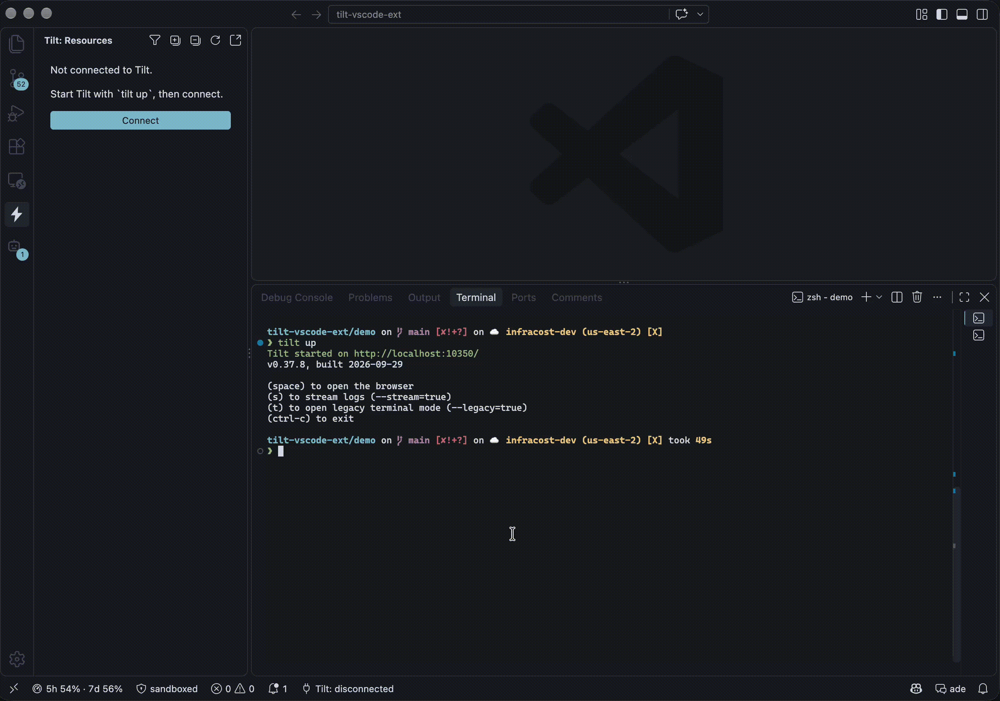

# Tilt Tools

[Tilt](https://tilt.dev) support for VS Code: a language server for Tiltfiles, a
sidebar for a running session, and up/down control from the editor.



## What it does

**Tiltfiles.** Syntax highlighting, hover with the real signature and documentation
for all 158 Tilt builtins, completion of parameters and namespace members, signature
help, go to definition, find references, an outline of your resources, clickable
manifest paths, and diagnostics with quick fixes. A Go language server does this,
bundled with the extension. It needs no cluster and no running Tilt.

**A running session.** A resource tree with status and grouping, a log panel with
filtering, trigger an update, open endpoints.

**Control.** Up and down buttons that find the Tiltfiles in your workspace.

## Install

```sh
make install
```

That builds the extension, packages a `.vsix`, and installs it into VS Code. Reload
the window afterwards.

Override the VS Code binary if you use Insiders:

```sh
make install CODE=code-insiders
```

## Use

1. Press the start button in the Tilt view, or run `tilt up` yourself.
2. Open the Tilt icon in the activity bar.

### Tiltfile editing

Open any `Tiltfile`, `*.tiltfile` or `.star` file. These work whether or not Tilt is
running.

| Keystroke | What you get |
| --- | --- |
| Hover | Signature, first doc paragraph, link to api.tilt.dev. Hover a keyword argument for that parameter's own docs. |
| Completion | Builtins at statement position, parameter names inside a call, members after a namespace dot, `TRIGGER_MODE_*` after `trigger_mode=` |
| Signature help | The enclosing call, with the current parameter highlighted |
| Go to definition | The `def` behind a call, the resource behind a `resource_deps` entry, or the file behind a path |
| Find references | Every `resource_deps` that names a resource |
| Outline | Your resources, then your Starlark bindings |
| Ctrl-click a path | Opens the file |

Diagnostics report a duplicate `local_resource`, a `resource_deps` naming no known
resource, a dependency cycle, a malformed `port_forwards`, and a call to something
that is not a Tilt builtin. Each stands down rather than guess: a Tiltfile that loads
an `ext://` module, builds resource names in a helper, or brings resources in through
`k8s_yaml` has an open set of names, so the cross-resource checks stay quiet.

Set `tilt.lsp.enabled` to `false` to turn the language server off. Everything else
keeps working.

The tilt-dev `Tiltfile` extension contributes the same language, so having both
installed makes highlighting ambiguous. This extension warns once if it finds it.

Each resource shows its status, coloured from the theme: green for ok, running or
completed, yellow for building or pending, red for an error.
The inline buttons trigger an update and show the log. A resource with endpoints also
gets a `$(globe)` button that opens one; with several, it asks which.

Click a resource to open its log. One panel serves every resource: clicking another
retitles it and swaps the content, so the editor never fills with log tabs. The
toolbar filters by level (all, info, warnings, errors) and by text — wrap the text in
slashes, as in `/pod-\d+/`, for a regexp. Errors are red and warnings yellow.
`Follow` keeps the view pinned to the newest line. Each resource keeps its last 5000
lines, which a Tilt restart or a reconnect drops; the panel shows the newest 2000 of
them, and `Copy` takes everything the filter leaves.

Resources are grouped by their Tiltfile `labels`, like the Tilt UI: labels A-Z, then
`unlabeled`, then `Tiltfile`. A group header shows its worst status and how many of
its resources are healthy. Without labels the list stays flat.

| Command | What it does |
| --- | --- |
| `Tilt: Connect` / `Tilt: Disconnect` | Open or close the connection. |
| `Tilt: Reconnect` | Drop state and reconnect. Also the status bar item. |
| `Tilt: Show Tilt Logs` | The Tilt-level log, not a resource log. Same panel. |
| `Tilt: Expand All Groups` / `Tilt: Collapse All Groups` | Title-bar buttons on the view. |
| `Tilt: Filter by Status` | Pick any set of statuses. The button fills in while a filter is on; click it to clear. |
| `Tilt: Up` | Run `tilt up` in its own terminal. Several Tiltfiles in the workspace means it asks which. |
| `Tilt: Stop` | Ctrl-C the `tilt up` this extension started. Tilt has no API for stopping, so a session started elsewhere has to be stopped where it runs. |
| `Tilt: Down` | `tilt down`, which **deletes the resources the Tiltfile deployed**. It does not stop a running `tilt up`. Asks first. |

## Settings

| Setting | Default | Notes |
| --- | --- | --- |
| `tilt.host` | `localhost` | |
| `tilt.port` | `10350` | |
| `tilt.token` | _empty_ | Session token. Read from `~/.tilt-dev/token` when empty. |
| `tilt.autoConnect` | `true` | Connect when VS Code starts. |
| `tilt.openInEditor` | `true` | `Open in Tilt UI` uses a Simple Browser tab. Off uses the system browser. |
| `tilt.lsp.enabled` | `true` | Run the Tiltfile language server. |
| `tilt.lsp.path` | _empty_ | A `tiltfile-lsp` binary to use instead of the bundled one. |

Changing the host, port, or token reconnects.

## How it connects

The extension uses the same web API as the Tilt UI: a WebSocket on `/ws/view` for
resources and logs, and `POST /api/trigger` to trigger an update. Both need Tilt's
session token, which Tilt writes to `~/.tilt-dev/token`.

If the status bar shows `Tilt: disconnected`, Tilt is not listening on the configured
host and port. The extension retries with backoff, so starting `tilt up` later is
enough.

## Demo stacks

`demo/Tiltfile` runs a handful of local resources — label groups, every status,
endpoint links, a manual trigger, and coloured output — with no cluster and no
private images. `demo-k8s/Tiltfile` deploys into a local cluster, so the pod status
and restart counts have something real behind them. See
[demo/README.md](demo/README.md) and [demo-k8s/README.md](demo-k8s/README.md).

## Develop

The extension is TypeScript at the root; the language server is a separate Go module
under `lsp/`.

```sh
make check      # typecheck, unit tests, go tests
make build      # bundle to dist/
make lsp        # build bin/tiltfile-lsp
npm run watch   # rebuild the TypeScript on change
```

Press F5 to launch an Extension Development Host.

The Tilt builtin table and the grammar's builtin lists are generated from the stub
tree `tilt dump api-docs` writes, vendored at `lsp/internal/builtins/gen/api`:

```sh
make lsp-dump   # refresh the stubs from the installed tilt
make lsp-gen    # regenerate builtins_gen.go and the grammar
```

CI reruns `make lsp-gen` and fails if either generated file is stale, and a weekly
workflow opens a pull request when Tilt publishes a release with a different API.

The semantic checks are measured against real Tiltfiles from public repositories
before being trusted, because a false report on working code costs more than a missed
one:

```sh
make lsp-corpus-fetch   # download into .corpus/
make lsp-corpus         # parse rate, unknown callees, diagnostic counts
```

## Release

Tag the commit and push the tag:

```sh
git tag v0.2.0 && git push origin v0.2.0
```

`.github/workflows/release.yml` then builds the `.vsix` files, hands the GitHub
release to goreleaser, and publishes to the registries.

goreleaser owns the release: it builds standalone `tiltfile-lsp` binaries for macOS,
Linux and Windows, writes checksums and a changelog, and attaches the `.vsix` files
alongside via `release.extra_files`. The binaries are there so a bug report can name
a version and so another editor can use the server — the extension bundles its own
copy and never downloads from the release.

```sh
make lsp-release-check      # validate .goreleaser.yml
make lsp-release-snapshot   # build the artifacts locally into dist-release/
tiltfile-lsp --version      # prints the build and the Tilt API version it describes
```

`scripts/package.js` runs twice:

1. `build` — stamps the tag version into the packaged `package.json` and writes
   the `.vsix` files, one per platform. The commit on `main` keeps whatever version it had; only the
   artifact is stamped.
2. `publish` — pushes those same `.vsix` files to the VS Code Marketplace and Open VSX.

The GitHub release is created between the two. Neither registry supports
un-publishing, so a failed publish leaves a release to retry against, rather
than a published version with nothing behind it.

Both publishes are skipped when their token is missing, so a fork releases
nothing by accident. Repository secrets:

| Secret | Used for |
| --- | --- |
| `VSCODE_PUBLISH_TOKEN` | Azure DevOps PAT with Marketplace → Manage. |
| `OPVSX_PUBLISH_TOKEN` | Open VSX access token. Needs `ovsx create-namespace owenrumney` once. |

The marketplace stalls for minutes at a time rather than failing cleanly, so a
publish that times out is retried after 60s and 180s, and the release then polls
the gallery until the new version is indexed.
